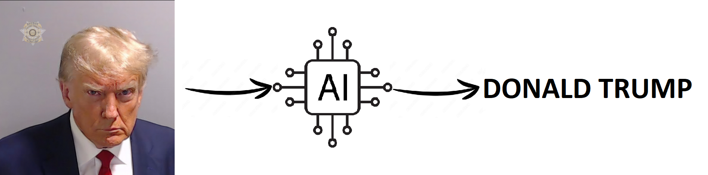

# Facial Recognition of US Presidents using SVM



This repository contains a machine learning project focused on facial recognition of US presidents, including Joe Biden, Donald Trump, and Barack Obama, using Support Vector Machines (SVM).

## Getting Started
To get started with this project, you can follow these steps:

### Clone the Repository
You can clone this repository using the following command:
```
git clone git@github.com:PeWeX47/Face-Recognition-Project.git
```

### Set Up a Virtual Environment (Optional)
It's a good practice to create a Python virtual environment to manage project-specific dependencies. [Tutorial on how to do it on Windows and Linux](https://realpython.com/python-virtual-environments-a-primer/)

### Install Required Libraries
To install the required libraries from the 'requirements.txt' file, use the following command:
```
pip install -r requirements.txt
```

## Data

The dataset used for this project is stored in the 'data' folder in .pkl format. The images were collected using the [Google-Image-Scraper](https://github.com/PeWeX47/Google-Image-Scrapper).

### Loading Data
To load the data in .pkl format, you can use Python's pickle library. Here's an example of how to load the data:

```
import pickle

# Load the training data
with open('data/data.pkl', 'rb') as file:
    data = pickle.load(file)

# You can access the data like this:
features = [feature for feature, label in data]
labels = [label for feature, label in data]
```

## Model
The trained SVM model can be found in the 'model' folder in .pkl format. This model has been trained to classify the facial features of the mentioned US presidents.

### Loading the Model
To load the model, you can use the following code:

```
import pickle

# Load the trained SVM model
with open('models/SVC.pkl', 'rb') as file:
    svm_model = pickle.load(file)
```

## Notebooks
The 'face-recognition-SVM.ipynb' notebook in this repository provides a step-by-step guide to data preprocessing and model training. 

